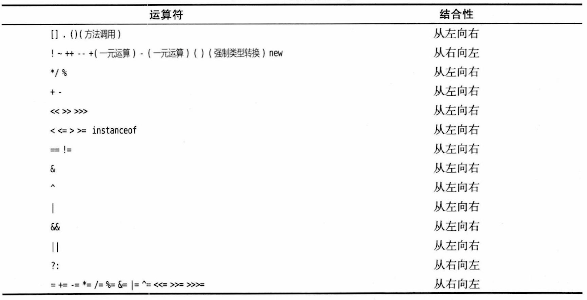
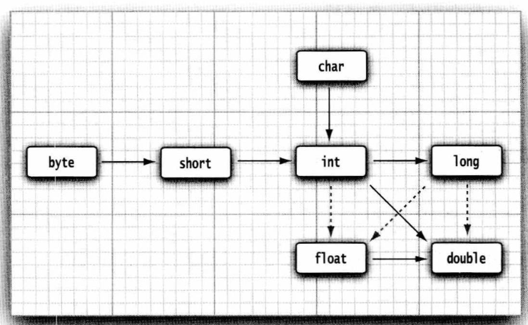

# 基础语法

## 运行环境有关的术语
| 术语名    | 解释 |
| :-----------: | ----------- |
| JDK，Java Development Kit      | 编写Java程序的程序员使用的软件       |
| JRE，Java Runtime Environment   | 使用Java程序的用户使用的软件        |
|JVM，Java Virtual Machine|Java虚拟机，运行Java程序的地方。编写好的程序被编译成目标代码/字节码，由JVM将字节码解释成具体机器上的机器指令来执行，从而屏蔽了与操作系统平台的差异，实现了跨平台特性，使得编写程序时无需过细的考虑软硬件差异。|
|Server JRE|在服务器上运行Java使用的软件|
|SE，Standard Edition|用于桌面或简单服务器应用的标准版Java平台|
|EE，Enterprise Edition|用于复杂服务器应用的企业版Java平台|
|ME，Micro Edition|用于小型设备的微型版Java平台|
|SDK，Software Development Kit|一个过时的术语，用来描述98～06年的JDK|
Java运行时环境JRE是供仅需要运行程序的用户使用的，而JDK相较于它还包含了用于开发的编译器等。

SE，EE，ME是一个宽泛的统称，可以理解为描述JDK的版本。JRE=JVM+一些Java提供的类库，JDK=JRE+一些开发工具。

>相较于初学时搞懂这些术语所指代事物内部包含的各种复杂东西，推荐通过搜索，去看一下他们之间包含、嵌套的示意图，从而更好地获得一个准确的宏观印象。

## 安装配置运行环境
>这部分的资料在网上太多了，这里描述一个大概的流程，不同操作系统略有差异。

安装JDK -> 配置环境变量(理解环境变量的概念)(Mac上不需要配置) -> 通过在命令行输入`javac --version`验证是否配置成功

这里面，javac是JDK所提供的工具集的其中之一，故通过随便运行这样一条没有副作用的JDK中的指令，来验证JDK是否成功安装，以及用以触达指令的全局变量是否成功配置。

这里需要先简单了解这样两条指令：

1. `javac <java代码文件路径>`，这表示将指定路径的java源代码编译为可在JVM运行的目标文件。经过这样的操作，`.java`源文件就变成了`.class`目标文件。
2. `java <java程序入口文件的目标文件路径>`， 通过这一命令运行上面编译好的目标文件，即可在JVM上运行Java程序。
	- 之所以叫入口文件，是因为一个程序会由若干个源文件组成，他们各司其职，他们会被编译成若干个对应的目标文件。
	- 而那个作为程序入口，程序启动处所在的文件，就是启动程序要运行的目标文件。
	- 对于其他的目标文件，JVM会自动的根据你编写代码时书写的调用关系，在需要时自动的引入调用其他被编译好的目标文件。

## 标识符
程序中所有你可以起名字的地方，你起的这个名字叫标识符，用于标记指代某一你创建/定义的事物，例如变量、函数、类。
它的命名需要遵循一定规则：

1. 字符只能由字母、数字、下划线_、dollar符号$组成（不能包含空格）；
2. 去分大小写；
3. 数字数字不能作开头；
4. 无长度要求；
5. 不能和关键字、保留字冲突（认识什么是关键字保留字）。

## 注释
对代码的解释描述。不会出现在可执行程序中，在编译时会被编译器忽略。所以你可以根据需要添加任意长度的注视，而无需担心代码膨胀。

三种注释方法：

1. `//`：单行注释。从该位置起到本行结束。
2. `/*``*/`：多行注释。被这两个注释界定符括起来的内容。
3. `/**``*/`：文档注释。用来生成使用文档，这种注释会在后面更恰当的位置介绍。

注释不能嵌套。

## 数据类型
Java是一种强类型语言，需要通过类型声明数据所需要占据/开辟的内存/存储空间；
<br>同时也标识数据的类别，不同类别的数据在处理上，尤其涉及到具体的业务，会有很多不同，这种声明有助于避免许多错误和麻烦(例如不同类型的识别转换)；
<br>但也丧失了一定的灵活性。

### 基本类型
有8种，4种整型，2种浮点型，1种字符类型，1种布尔类型

|类型/关键字|存储空间|描述|
|------|--------|-------|
|整型-int|4byte|用于存储没有小数部分的数值|
|整型-short|2byte|和int仅大小差异|
|整型-long|8byte|和int仅大小差异，表示一些它表示不了的更大的数|
|整型-byte|1byte|和int仅大小差异，它恰好也是个容量单位，刚好是一字节byte，8位bit|
|浮点-float|4byte|浮点数表示有小数部分的数值。也叫单精度，下面的叫双精度|
|浮点-double|8byte|表示的比float更精确，有效位数更多|
|字符-char|一般为2byte，取决于具体字符集|表示单个字符|
|布尔- boolean|规范种没明确指出|只有true和false连个值，用来判断逻辑条件|
这些数据类型没有必要太关注他们到底多大、到底能表达哪个范围的数据，也根本记不住，了解个大致、相对的大小，等什么时候真用上了再去查就好了。

**浮点数的精度是有限的**：它的有限精度不只体现在小数点后的位数，还体现在有些数字哪怕是用double也是根本无法表示的。这是由于二进制、十进制本身的局限导致的，这一点相信你在中学就已经有所体验——无限不循环小数。每一个进制都有这样的限制，没有办法描述标记所有的值。
>所以浮点数不适合无法接受舍入误差的计算，例如某些与钱有关的范畴。Java执行2.0-1.1得到的结果是0.8999999999999999999，这种误差是因为存储浮点数的二进制无法精确表示分数1/10，就像十进制无法精确表示1/3一样。这种情形如果希望没有误差，可以使用Java提供的BigDecimal类，稍后会有提到。也可以以分为单位去处理金钱，在展示的时候除100即可。

有关字符，需要先了解什么是**字符集**：字符集是一系列字符与计算机中存储规则的对应关系集合。确切说就是它规定了二进制编码所对应的字符。不同的字符集涵盖了不同的字符，有的只涵盖了最基本的一些字符、有的包含多个国家的语言、有的还涵盖了emoji。所以不同的字符集就会产生不同的编码规则，解析数据所得出的对应字符也就不一样。
<br>char不见得表示单个字符，因为Unicode字符集有些字符可以用一个char描述，而有些要用两个。
<br>常见字符集：ASCII、ISO8859-1、GB18030、UTF-16。
<br>Java中char类型描述了UTF-16编码中的一个代码单元。
<br>有关Unicode、UTF的发展、实现细节，这里不展开，有需要可自行搜索。

**转义字符**：存在一系列的关键字、保留字，或Java语言的某些构成语法的字符，例如各种括号。我们无法直接书写，因为他们已经被用作语法功能；还有一些符号，我们的键盘无法直接输入例如回车；还有一些可以输入但有特殊含义，比如空格、制表符、换行符，我们需要一种途径来表示他们。
<br>转义字符就起这个用处。通过转义字符`\`和其他某些字符构成转义序列，表示一个新的字符。
<br>具体的转义序列与字符名称对照表可自行搜索。

## 常量、变量、字面量
常量与变量可以理解为**具有名称的数值**/数据，用于在内存中暂存运行程序所需要的数据。

**常量**就是值不变、且不允许改变的变量。

除了通过名字拿到变量使用其值，变量的使用还有如下几个概念：

1. **声明/定义**：告诉编译器，在内存中开辟大小符合类型声明的一块区域、你需要一个如你所声明类型、名称的数据。这是一切的开始，变量要先声明，才能进行后面的步骤。
	- 不同于C++，Java中不区分变量的定义与声明，这是一件事儿。
2. **初始化**：一个变量在声明之后，只会产生一个名称指向一个存储数据的区域，但这个变量此时是没有值的。你可能需要给他一个初始的值，给变量首次赋值的过程，就叫变量的初始化。
	- 初始化可以和声明同时进行，或者说写在一个语句里。这一点会在下面的语法规则描述中看到。
	- 不可以使用一个未经初始化的变量。
3. **赋值**：设置变量的值。使用等号赋值。

	> 从语法书写上，初始化和赋值是一样的。

这些概念对应的语法/书写规则：

1. 声明：`<类型> <标识符>;`，例如`int vacationDays;`。
2. 初始化：`<标识符> = <值/表达式>`，例如`vacationDays = 10;`。
3. 声明并初始化：`<类型> <标识符> = <值/表达式>;`，例如：`int vacationDays = 10;`。
4. 赋值：和初始化一样。

	> 这里表达式和你数学中认识的那个概念基本一致：一段可执行的代码/语句，执行后得到一个值。
	

**常量**：通过关键字final表示这个关键字只能被赋值一次。常量需要在声明时就立刻初始化赋值。语法为：`final <类型> <标识符> = <值/表达式>`。

**字面量**：被直接书写的数值，例如10、3.14、'c'。不同数据类型的字面量书写不同。

- 直接书写的整数数值被视为整数，通过添加尾缀`L`或`l`将正数字面量标识为long类型（或者数值超出int范围必须被推断为long），规范中没有指出如何书写一个byte或short类型的字面量。

- 带小数点的数被默认是为double类型的字面量（包括5.0，0.0这样的写法），通过尾缀`f`或`F`将字面量标识为float类型，double类型则是在后面添加`D`或`d`。

- 所有的数字类型的字面量都默认采用十进制，通过前缀标识字面量所采用的进制，十六进制为`0x`或`0x`，八进制为`0`，二进制为`0b`或`0B`。

- 字符类型的字面量有三种表示方式：直接使用单引号括起字符，例如'A'，注意时单引号，双引号表示的是字符串(后面会介绍)；使用转义序列表示的特殊字符，例如`\n`；使用转义序列`\u`+字符的十六进制Unicode编码表示，例如`\u2122`表示商标符™️。
	- 需要注意第三种表示方法，不光可以用来表示值，也可以用来书写程序，出现在加引号的字符或加双引号的字符串之外，成为程序的一部分。所书写的Unicode转义序列会在代码解析运行之前就得到处理将他们替换为所对应的字符。
	<br>例如，像`"\u0022+\u0022"`(\u0022对应的字符为")，并不会单纯的替换为unicode对应的字符，解析为由两个双引号中间夹一个加号的字符串，而是编译前就直接被替换成了两个引号，然后按照`""+""`来编译的，也就是两个空字符串相加，最终结果是个空字符串。
	
## 运算符
### 算数运算符
这里不浪费篇幅介绍哪些你在数学课上学过的，介绍一些编程语言特有的。

赋值运算符：`=`，将右操作数的值，填入左操作数——名称所指向的变量。

赋值运算符可以和其他二元（只有左右两个操作数的）运算符结合使用：`<某运算符>=`，效果为使用左操作数和右操作数运算，将得到的结果赋值给左操作数。

自增运算符与自减运算符：`++`，`--`。这是个单目运算符，效果为将操作数的值增加或减少1。该操作符与操作数的相对位置不同，执行的效果也不同，主要体现在多个运算符一起运算构成表达式时，先执行增减操作还是先使用操作数的值进行其他运算。
> 举例：`a = 3 * m++`和`a = 3 * ++m`的区别就是m到底数先加还是先用，前者就是先用，先用m的旧值参与表达式运算，得到结果赋值给a，再执行m自己的自增；后者则是先执行自增，拿着自增后的新值参与表达式运算。

### 关系运和boolean算符
相等：`==`，不相等：`!=`，大于：`>`，小于：`<`，大于等于：`>=`，小于等于：`<=`，与：`&&`，或：`||`，非：`!`。

注意：与运算符，如果左操作数为假，那结果就一定是假，就不会再考察右值了，如果右操作数数一个求值表达式，就不会执行；或运算符同理，如果左操作数为真，结果一定是真，程序就不会执行到右边，而是直接返回值后，执行后面的内容。

三元操作符：`<条件> ? <为真时的值/表达式> : <为假时的值/表达式>`，对条件求值，如果为真(求值后)返回冒号左边的，假则右边。

### 位运算符
按位与（and）：`&`，按位或（or）：`|`，按位异或（xor）：`^`，按位取反（not）：`~`。

### 运算符的优先级
多个运算符、操作数构成表达式时，先算谁，后算谁，规则如下。

除此之外，可以通过圆括号改变优先级——先计算括号内。

这可以看到，方法调用，类成员的调用符号，都是一种运算符，可以成为表达式的一部分。事实上其实是反过来的，所有的运算符都可以被视为一种特殊的方法，经由事先约定，虽然有着不同与方法的使用形式，但本质上都是接收参数后按照一定规则运算返回结果。像C++这种语言，运算符被完全视为函数的一种，可以通过函数重载，在特定情形下改变这些运算符的行为/规则。
## 类型转换
前面提到，Java中的数据分为不同类型，不同类型所占的空间、能表达的值范围都是不一样的，那么不同类型的数据构成的表达式，将表达式结果赋值给一个变量，表达式的执行结果是什么类型的呢？这个类型和变量类型不一样时，变量最终的值又是如何呢？

Java语法规定，基本数据类型中合法的转换规则如下：

可以看到这样一条规律，两个不同精度的值进行运算是，倾向于将精度低的一方转换为精度高的类型；并且在这种转换中可能会有精度丢失，图中用虚线指出的方向是几个会丢失精度的情形。

>例如一个大整数和单精度浮点运算，long的位数比float是多的，如果long类型的这个数很大，实际运算的时候这样转换就会丢失精度，被转换为一个意料之外的错误值后和float执行运算，得到一个错误结果。

**自动类型转换**：在默认的情况下，如果两个不同类型的变量在一起相互运算，就会按照上面所允许的规则，进行自动类型转换。

**强制类型转换**：而在有些情况，我们需要手动、强制将一个变量/字面量的值转换为我们需要的类型，尽管这种转换不符合规则，会引起精度丢失以及数据错乱。强制类型转换的语法为，在圆括号中给出目标类型，后面跟需要转换的变量/值/表达式：`(类型) 变量`。

数值之间的类型转换只伴随精度和大小的变动，不过基本类型中除数值类型的剩下两种类型较为特殊：

- char类型与其他类型的相互转换，基于其unicode的值。即其他数字类型转换为char，长度比它小的，会在二进制左边补零补齐位数，长度比它大的会进行截取，有小数部分截取小数部分，整数部分长度依然超出则舍弃高位，最终将这个数值填入char类型的变量。也就是说数值类型转换为char，得到的字符是该数值在unicode中对应的字符；反之char转换为数值类型，结果为该字符的unicode值。

- boolean：Java不允许布尔类型与其他类型之间转换。不过你可以借助三元表达式定义规则，间接实现转换。

同理

- char在参与各种运算的时候，参与运算的值都是它背后的unicode对应的二进制值，事实上它在内存中的存储本来也是unicode对应的二进制，只不过由于这样的类型声明，它在显示的时候会被转换为对应的字符显示出来。

- 布尔值只能参与逻辑运算，如果将它用于算数运算、位运算，编译器会抛出错误。

## 流程控制
在单个Java源文件的某个代码片段中，程序的执行遵循如下规则：

- 从上到下，从左到右。

- 通过空格或换行分隔名字、关键字。所有连续多个的空格换行都会被忽略，解析压缩为单个空格。

	- 可以通过缩进、换行、空格等方式格式化代码使代码变得更美观易读。

- 语句为Java程序执行的最小单元，通过分号`;`标识语句结束。语句的末尾也必须以`;`结尾。

- （语句）块：若干条语句用`{}`括起来。

	- 它的主要用途在于确定变量的作用域——块内的声明的名称，无法在块外访问到。

	- 块可以嵌套，但多个嵌套的块不能同时声明同一个名字，Java不允许在嵌套的块中声明同样的变量。

	- 代码块不光可以单独使用，还存在与下面的某些流程控制语句中，这些情况下同样有着作用域划分的效果。

- 条件语句

	```Java
	if(<condition>){
		<do something when true>
	}else{
		<do something when false>
	} //else可以省略
	```
	```Java
	if(condition1){
		<do something when true>
	}else if(condition2){
		<do something when true
	}else{
		<do something when false>
	}//else if可以无限叠加；else也可以省略
	```
	```Java
	//如果要执行的语句只有一句，也可以压行写，用单个语句替代代码块
	if(condition) <do something when true without ';'> else <do something when false>
	//同样的，else可以省略
	if(condition) <do something when true>
	//还可以写成这样
	if(condition) <do something when true>
	else <do something when false>
	//中间还可以加入若干else if 
	```
- 循环
	
	```Java
	while(condition){
		<do something when true>
	}
	```
	```Java
	//也可以是单个语句，不使用语句块
	while(condition) <do something when true>
	```
	```Java
	//也可以把循环体放在前面，先执行后判断，这样依赖，循环体会被至少执行一次
	do{
		<do something when true or on initial entry>
	}while(condition);
	```
- 确定循环

	for循环语句是支持迭代的一种通用结构，由一个计数器或者一个类似的变量标记与迭代有关的状态，用于决定是否满足循环条件。
	
	```Java
	for(counter initialization; condition; iterator){
		//第一部分通常为计数器或者什么别的用来指示循环进行状态/进程的标志的初始化，是一个声明并初始化变量的语句
		//第二部分在每次循环前，包括第一次，检测条件，判断是否要执行循环体
		//第三部分是一个语句，指定在每次循环(体执行)结束后调用，指示如何更新第一部分创建的这个标志着循环所做的事情进度的变量
		<loop body>
	}
	```
- switch语句：多重选择

	在处理多种情况，对不同的情况做出不同响应时，if/else结构稍显笨拙。switch提供了一种更简洁的表达：
	
	```Java
	switch(expression){
		case value1:
			<do something when macted>
			break;
		case value2:
			<do something when macted>
			break;
		...
		default: 
			<do something when all case don't match>
			break;
	}
	```
	用于判断的条件是一个执行后能返回值的表达式(expression)，显然也可是一个变量，这是最简单的情形，也可以是变量运算后的结果，还可以是一个有返回值的函数调用。
	
	从上向下执行，每当值匹配case后的值时，进入这个case内部，执行内部的语句。
	
	break用于跳出switch语句块，所以说如果你忘记写了break，要是后面的case都符合，就会都执行一遍。
	
	当所有情形都不符合时，控制流进入default，执行default内的语句。
- 中断流程控制：break与continue

